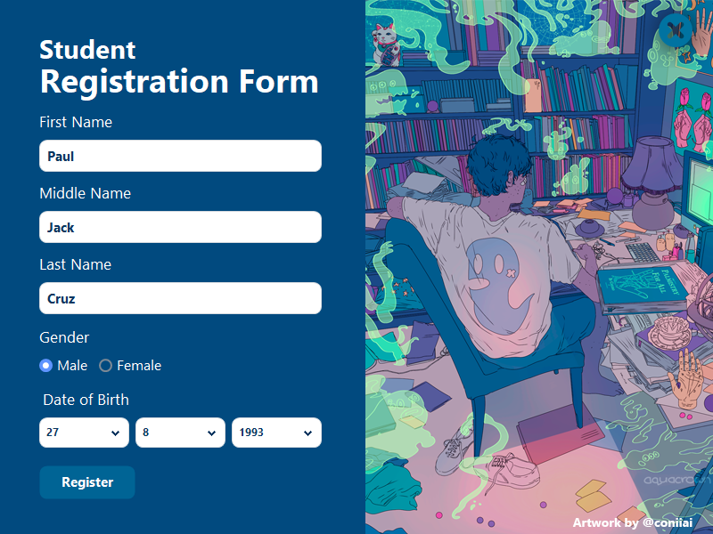
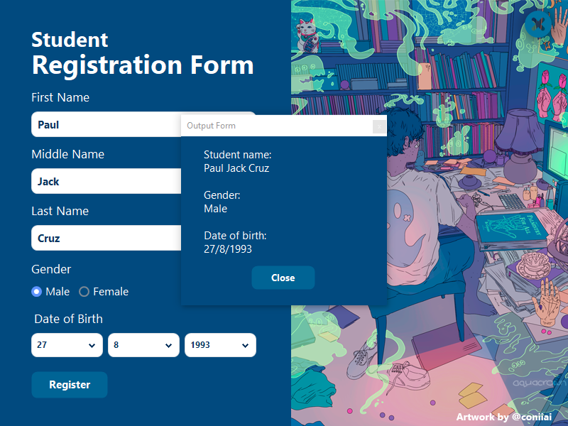

# Student Registration Form 🎓 
A C# activity in the subject Integrative Programming that aims to create a student registration form in winform. I made the UI more interesting than the original. The program uses **.Net Framework version 4.6.1**. 

## Screen Shot 📷

	
	

## Contribution 🔥

If you wish to help improve this project, fork this repo and submit your own pull request. If you discover a problem with this project, please report it to the issue page. Thank you very much 😊.

## Thank you 😃

If you like this project just click ⭐ and share it with others.
